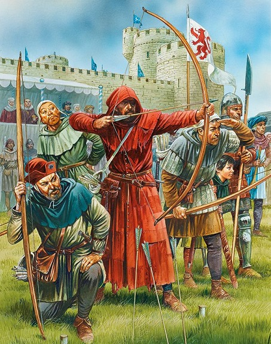

# Kingdoms Ep.3: Archery Tournament

[@codewars](https://www.codewars.com/kata/616eedc41d5644001ff97462)

Yesterday the Priest gambled away his monastery, vineyard and all his fortune to the Witch. To make some gold for a living, he decided to enter the King's archery tournament (he is a good archer because before he was a famous outlaw).

## Task

You are given the array (`target` archery) of strings of *asterisks* (for better visibility) and *letters* (arrows hitting the target). You should count the number of *points* of each kind of arrow(lowercase letters), sort them and return the array of the sorted letters. Also, it may happen that two arrows of the same kind end up at the same position. If that happens, you'll see an uppercase letter instead.

## Uppercase letters

An uppercase letter means two corresponding lowercase letters in the same place(count it as two arrows). However, there can't be two different types of letters in the same place (because the King ordered to invalidate the previous arrows of the different type in the same place).

## How to score the points

The target is a square (in real life is a round) of "rings". The most remote ring from the center is worth one point and the next rings will be worth one point more than the previous.

## How to sort

Sort the letters by their score(sum of points) in ascending order. If their scores are equal, sort the letters by quantity of arrows in the descending order. If the quantities of arrows are equal, sort by letters(UTF-16) in the ascending order.

## Notes

- The square target might be of different length (always odd);

- There will be always the target.

## Example 1

```text
    target:
    ["z**",
     "*a*",
     "***"]
    
    return  ["z", "a"]
```

because `z` = 1 point and `a` = 2 points

## Example 2

```text
    target:
    ["z*B",
     "*a*",
     "**z"] 
   
    return [b, z, a]
```

because: `b` = 2 points(2 arrows), `z` = 2 points(2 arrows) and `a` = 2(1 arrow).

If you like this kata, check out the another one: [Kingdoms Ep.4: The Dancing Witch](https://www.codewars.com/kata/6171a85207ab6b003fadc43e/discuss#61733c5c0a7a9300373d5f97)



*The Priest trying to hit the target and to hit the jackpot*

## Tags

ARRAYS
