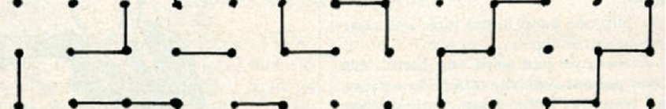
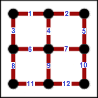
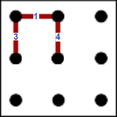
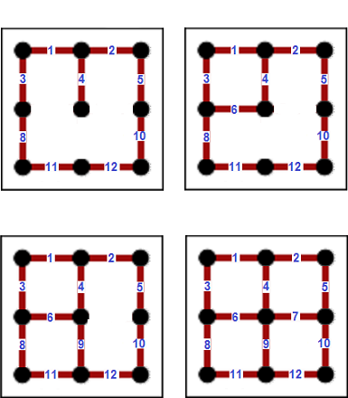

# Pigs in a Pen

[@codewars](https://www.codewars.com/kata/58fdcc51b4f81a0b1e00003e)

## Introduction

Dots and Boxes is a pencil-and-paper game for two players (sometimes more). It was first published in the 19th century by Édouard Lucas, who called it la pipopipette. It has gone by many other names, including the game of dots, boxes, dot to dot grid, and pigs in a pen.

Starting with an empty grid of dots, two players take turns adding a single horizontal or vertical line between two unjoined adjacent dots. The player who completes the fourth side of a 1×1 box earns one point and takes another turn only if another box can be made. (A point is typically recorded by placing a mark that identifies the player in the box, such as an initial). The game ends when no more lines can be placed. The winner is the player with the most points. The board may be of any size. When short on time, a 2×2 board (a square of 9 dots) is good for beginners. A 5×5 is good for experts. (Source [Wikipedia](https://en.wikipedia.org/wiki/Dots_and_Boxes))



## Task

Your task is to complete the class called `Game`. You will be given the `board` size as an integer board that will be between `1` and `26`, therefore the game size will be `board x board`. You will be given an array of lines that have already been taken, so you must complete all possible squares.

## Rules

1. The integer `board` will be passed when the class is initialised.

2. `board` will be between `1` and `26`.

3. The `lines` array maybe empty or contain a list of line integers.

4. You can only complete a square if `3` out of the `4` sides are already complete.

5. The `lines` array that is passed into the `play()` function may not be sorted numerically!

## Returns

Return an array of all the lines filled in including the original lines.

Return array must be sorted numerically.

Return array must not contain duplicate integers.

## Example 1

### Initialise

Initialise a board of 2 squares by 2 squares where `board = 2`


### Line Numbering



### Line Input

So for the line input of `[1, 3, 4]` the below lines would be complete



to complete the square line `6` is needed

### Game Play

```typescript
board = 2
lines = [1, 3, 4]
game = Game.new(board)
game.play(lines) => [1, 3, 4, 6]
```

## Example 2

### Initialise

```typescript
board = 2
lines = [1, 2, 3, 4, 5, 8, 10, 11, 12]
game = Game.new(board)
game.play(lines) => [1, 2, 3, 4, 5, 6, 7, 8, 9, 10, 11, 12]
```

### Solution



> Good luck and enjoy!

## Kata Series

If you enjoyed this, then please try one of my other Katas. Any feedback, translations and grading of beta Katas are greatly appreciated. Thank you.

**6 kyu** [Maze Runner](https://www.codewars.com/kata/58663693b359c4a6560001d6)

**6 kyu** [Scooby Doo Puzzle](https://www.codewars.com/kata/58693bbfd7da144164000d05)

**7 kyu** [Driving License](https://www.codewars.com/kata/586a1af1c66d18ad81000134)

**6 kyu** [Connect 4](https://www.codewars.com/kata/586c0909c1923fdb89002031)

**6 kyu** [Vending Machine](https://www.codewars.com/kata/586e6d4cb98de09e3800014f)

**6 kyu** [Snakes and Ladders](https://www.codewars.com/kata/587136ba2eefcb92a9000027)

**6 kyu** [Mastermind](https://www.codewars.com/kata/58a848258a6909dd35000003)

**6 kyu** [Guess Who?](https://www.codewars.com/kata/58b2c5de4cf8b90723000051)

**6 kyu** [Am I safe to drive?](https://www.codewars.com/kata/58f5c63f1e26ecda7e000029)

**6 kyu** [Mexican Wave](https://www.codewars.com/kata/58f5c63f1e26ecda7e000029)

**6 kyu** [Pigs in a Pen](https://www.codewars.com/kata/58fdcc51b4f81a0b1e00003e)

**6 kyu** [Hungry Hippos](https://www.codewars.com/kata/590300eb378a9282ba000095)

**6 kyu** [Plenty of Fish in the Pond](https://www.codewars.com/kata/5904be220881cb68be00007d)

**6 kyu** [Fruit Machine](https://www.codewars.com/kata/590adadea658017d90000039)

**6 kyu** [Car Park Escape](https://www.codewars.com/kata/591eab1d192fe0435e000014)

## Tags

PUZZLES, ARRAYS, FUNDAMENTALS
