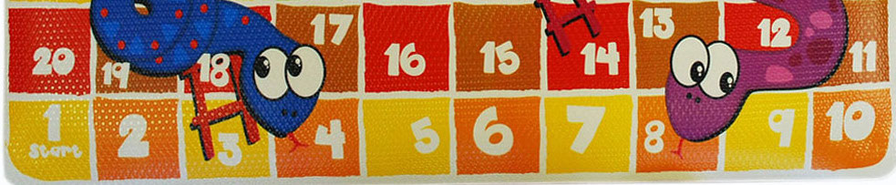
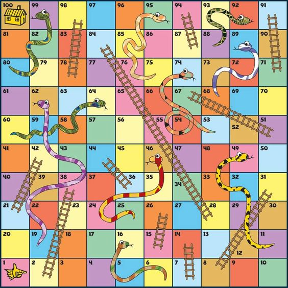

# Snakes and Ladders

[@codewars](https://www.codewars.com/kata/587136ba2eefcb92a9000027)

## Introduction

Snakes and Ladders is an ancient Indian board game regarded today as a worldwide classic. It is played between two or more players on a gameboard having numbered, gridded squares. A number of "ladders" and "snakes" are pictured on the board, each connecting two specific board squares. (Source [Wikipedia](https://en.wikipedia.org/wiki/Snakes_and_Ladders))

## Task

Your task is to make a simple class called `SnakesLadders`. The test cases will call the method `play(die1, die2)` independantly of the state of the game or the player turn. The variables `die1` and `die2` are the die thrown in a turn and are both integers between 1 and 6. The player will move the sum of die1 and die2.

## The Board

## Rules

1. There are two players and both start off the board on square 0.

2. Player 1 starts and alternates with player 2.

3. You follow the numbers up the board in order 1=>100

4. If the value of both die are the same then that player will have another go.

5. Climb up ladders. The ladders on the game board allow you to move upwards and get ahead faster. If you land exactly on a square that shows an image of the bottom of a ladder, then you may move the player all the way up to the square at the top of the ladder. (even if you roll a double).

6. Slide down snakes. Snakes move you back on the board because you have to slide down them. If you land exactly at the top of a snake, slide move the player all the way to the square at the bottom of the snake or chute. (even if you roll a double).

7. Land exactly on the last square to win. The first person to reach the highest square on the board wins. But there's a twist! If you roll too high, your player "bounces" off the last square and moves back. You can only win by rolling the exact number needed to land on the last square. For example, if you are on square 98 and roll a five, move your game piece to 100 (two moves), then "bounce" back to 99, 98, 97 (three, four then five moves.)

8. If the Player rolled a double and lands on the finish square “100” without any remaining moves then the Player wins the game and does not have to roll again.

## Returns

Return `Player n Wins!`. Where n is winning player that has landed on square 100 without any remainding moves left.

Return `Game over!` if a player has won and another player tries to play.

Otherwise return `Player n is on square x`. Where n is the current player and x is the sqaure they are currently on.

> Good luck and enjoy!

## Kata Series

If you enjoyed this, then please try one of my other Katas. Any feedback, translations and grading of beta Katas are greatly appreciated. Thank you.

**6 kyu** [Maze Runner](https://www.codewars.com/kata/58663693b359c4a6560001d6)

**6 kyu** [Scooby Doo Puzzle](https://www.codewars.com/kata/58693bbfd7da144164000d05)

**7 kyu** [Driving License](https://www.codewars.com/kata/586a1af1c66d18ad81000134)

**6 kyu** [Connect 4](https://www.codewars.com/kata/586c0909c1923fdb89002031)

**6 kyu** [Vending Machine](https://www.codewars.com/kata/586e6d4cb98de09e3800014f)

**6 kyu** [Snakes and Ladders](https://www.codewars.com/kata/587136ba2eefcb92a9000027)

**6 kyu** [Mastermind](https://www.codewars.com/kata/58a848258a6909dd35000003)

**6 kyu** [Guess Who?](https://www.codewars.com/kata/58b2c5de4cf8b90723000051)

**6 kyu** [Am I safe to drive?](https://www.codewars.com/kata/58f5c63f1e26ecda7e000029)

**6 kyu** [Mexican Wave](https://www.codewars.com/kata/58f5c63f1e26ecda7e000029)

**6 kyu** [Pigs in a Pen](https://www.codewars.com/kata/58fdcc51b4f81a0b1e00003e)

**6 kyu** [Hungry Hippos](https://www.codewars.com/kata/590300eb378a9282ba000095)

**6 kyu** [Plenty of Fish in the Pond](https://www.codewars.com/kata/5904be220881cb68be00007d)

**6 kyu** [Fruit Machine](https://www.codewars.com/kata/590adadea658017d90000039)

**6 kyu** [Car Park Escape](https://www.codewars.com/kata/591eab1d192fe0435e000014)

## Tags

DESIGN PATTERNS, GAMES, FUNDAMENTALS
